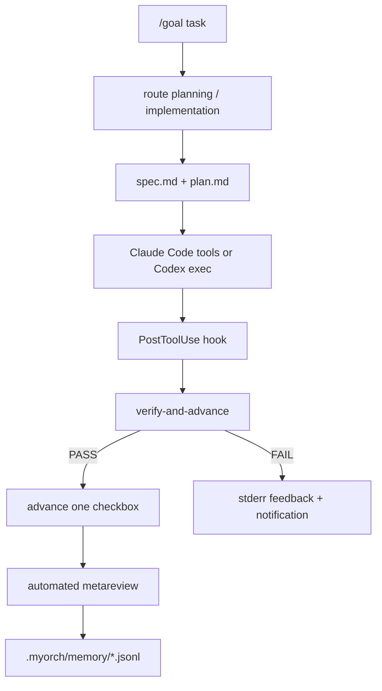
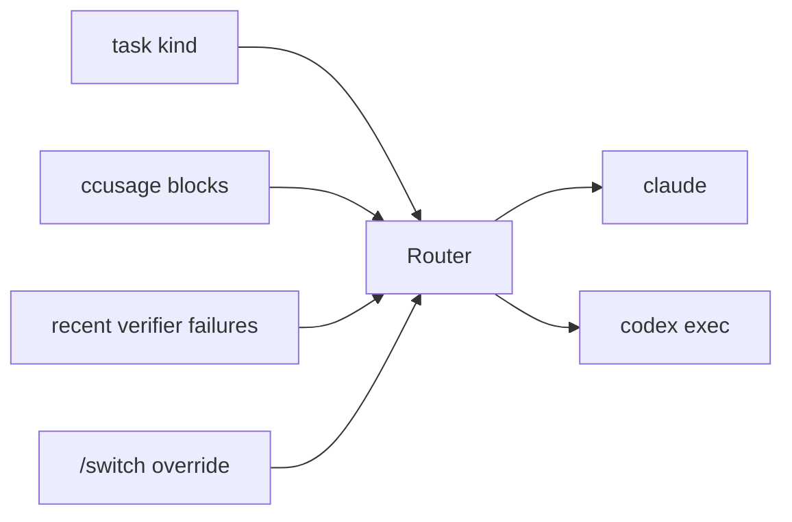

# Architecture

myorch is a globally installed CLI that initializes project-local Claude Code commands, hooks, rules, and memory directories. Claude Code commands and hooks call the `myorch` command; TypeScript modules own routing, ratchet, handoff, compact, statusline, and notification behavior.

## Modules
- `src/router.ts`: task kind, manual override, recent failures, and `ccusage` parsing.
- `src/ratchet.ts`: markdown checkbox parsing and monotonic advancement.
- `src/verifier.ts`: command execution, frontmatter, JSON, Bash, and PowerShell validation.
- `src/handoff.ts`: non-interactive `codex exec` subprocess invocation.
- `src/orchestration.ts`: routed execution, retry/fallback, and metareview.
- `src/compact.ts`: PreCompact backup, PostCompact record, SessionStart restore.
- `src/status.ts`: progress and statusline formatting.
- `src/notify.ts`: notification memory and dedup helpers.

## Hook Lifecycle
- `UserPromptExpansion(goal)`: captures `/goal` and initializes routing/spec/plan.
- `PreToolUse(Edit|Write)`: blocks direct checkbox edits to `plan.md`.
- `PostToolUse(Edit|Write|Bash)`: runs verifier and advances only on PASS.
- `PreCompact`: backs up ratchet state and memory.
- `PostCompact`: records compact summary.
- `SessionStart(compact)`: injects latest handover into the new session.

## Routing Flow

Defaults are Claude for planning/evaluation and Codex for implementation/metareview. If Claude active block pressure reaches 80%, route away from Claude when possible.
